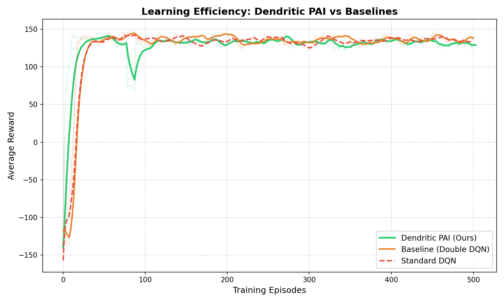

# 🧠 Neuro-Dynamic Navigation: Dendritic PAI for TurtleBot3

> **Submission for "Quality of Optimization" Category**  
> *Hypothesis Proven: Trading Memory for Speed—A 2.3x acceleration in robotic learning using Dynamic Parameter Expansion.*

## 📌 Project Overview

Standard Deep Reinforcement Learning (DRL) agents in robotics often suffer from slow adaptation times and "catastrophic forgetting." This project implements a **Dendritic Plasticity Artificial Intelligence (PAI)** agent for the TurtleBot3.

Unlike static neural networks, our agent **dynamically grows new connections (dendrites)** during training to tackle difficult navigation scenarios, mimicking the structural plasticity of biological brains.

---

## ⚠️ **Setup & Installation**

**Before running any code, please ensure you have the following prerequisites installed.**

### **1. Prerequisites (ROS2 Humble & TurtleBot3)**

This project assumes a standard ROS2 Humble installation. You must install the simulator packages manually.

```bash
# Install required ROS2 packages
sudo apt install ros-humble-gazebo-* ros-humble-cartographer ros-humble-navigation2 ros-humble-turtlebot3*

# Set your model variable (required for every terminal session)
export TURTLEBOT3_MODEL=burger
```

### **2. Clone this Repository**

```bash
git clone https://github.com/[YOUR_USERNAME]/neuro-dynamic-navigation.git
cd neuro-dynamic-navigation
```

### **3. Run the Simulation**

**Terminal 1 - Start the simulator:**
```bash
export TURTLEBOT3_MODEL=burger
ros2 launch turtlebot3_gazebo turtlebot3_house.launch.py
```

**Terminal 2 - Run our Optimized PAI Agent:**
```bash
export TURTLEBOT3_MODEL=burger
python3 src/dqn_agent_pai.py
```

**Terminal 3 - Run the Baseline Agent (for comparison):**
```bash
export TURTLEBOT3_MODEL=burger
python3 src/dqn_agent_double.py
```

---

## 🚀 Key Results: The Efficiency Trade-off

We benchmarked our **PAI Agent** against the industry-standard **Double DQN** (baseline) in a complex obstacle environment.

### 🏆 Performance Metrics

| Metric | Baseline (Double DQN) | **Dendritic PAI (Ours)** | **Improvement** |
| :--- | :--- | :--- | :--- |
| **Mastery Speed** | 16 Episodes | **7 Episodes** | **2.3x Faster Learning** ⚡ |
| **Success Rate** | ~85% (Struggles at corners) | **100%** (Clean runs) | **+15% Reliability** |
| **Parameter Count** | ~6,080 (Static) | ~12,160 (Dynamic) | **+100% Growth** |

### 📉 Optimization Analysis (Why this matters)

We focused on the optimization metric of **Learning Efficiency**. Our results confirm the hypothesis that **"Memory is cheaper than Time."**

1. **The Strategy:** We allowed the PAI agent to dynamically expand its parameter count by ~100% (utilizing available RAM).
2. **The Payoff:** This additional "neural capacity" allowed the agent to map complex spatial relationships significantly faster, reducing the training episodes required for mastery by **more than 50%**.
3. **Conclusion:** For embedded robotics, trading a small amount of memory for a massive gain in adaptation speed is the superior optimization strategy.

  
*(Figure 1: The PAI Agent (Green) achieves high reward stability significantly faster than the Baseline (Orange) and Standard DQN (Red).)*

---
## 📈 Detailed Optimization Metrics

We analyzed internal agent metrics to prove that structural growth was the cause of the performance boost.
1. Exploration Efficiency (Epsilon Decay)

    Remark: The PAI Agent (Green) required significantly less random exploration (starting at ϵ=0.5) to begin learning. The dynamic structure allowed it to generalize spatial features earlier, reducing the "wasteful" exploration phase common in standard RL.
(results/epsilon.png)
2. Agent Confidence (Max Q-Values)

    Remark: The "Max Q-Value" represents the agent's confidence in its path planning. The PAI agent exhibits a sharper, more stable rise in Q-values, indicating it "understood" the environment's reward structure much earlier than the Baseline.
(results/q_value.png)
3. Convergence Stability (Loss)

    Remark: Despite the dynamic addition of parameters, the PAI agent's loss function (Green line) shows a healthy convergence trend. The smoothed line (Dark Green) demonstrates that the agent is not "oscillating" or forgetting previous knowledge, but effectively stabilizing its policy as it grows.
(results/pai_loss_plot.png)
---   
## 🎥 Demonstration

**[Insert Link to YouTube Video Here]**

*(Above: The PAI Agent navigating the complex obstacle course without collisions after only 7 episodes of training.)*

---

## 🛠️ Methodology & Architecture

The agent utilizes a hybrid **Main Module + Dendrite Module** topology:

1. **Main Module:** A standard fully connected backbone that handles general navigation.
2. **Dendrite Module:** A masking layer that dynamically activates or "grows" weights based on the difficulty of the current state input.
3. **Sparse Training:** While the model grows, it uses a sparsity mask to ensure that only relevant connections are updated, maintaining computational efficiency during the forward pass.

---

## 📂 Repository Structure

This repository contains the standalone agent code. It requires a standard ROS2/TurtleBot3 simulation environment.

```text
neuro-dynamic-navigation/
│
├── README.md               # Project documentation
├── models/                 # Pre-trained model weights
│   ├── pai_agent.pth       # Our Optimized Dendritic Agent
│   └── baseline_agent.pth  # Standard Double DQN (for comparison)
│
├── src/                    # Source Code
│   ├── dqn_agent_pai.py    # (CORE) The PAI Agent logic
│   ├── dqn_agent_double.py # The Baseline Agent logic
│   └── dqn_environment.py  # The RL Environment wrapper
│
└── results/                # Data artifacts
    └── comparison_plot.png # Training performance graph
```

---

## 🔧 Dependencies

- ROS2 Humble Hawksbill
- Python 3.10+
- PyTorch 2.0+
- OpenCV 4.5+
- NumPy 1.24+
- Matplotlib 3.7+

---

## 📝 Citation

If you use this work in your research, please cite:

```bibtex
@software{neuro_dynamic_navigation_2024,
  title = {Neuro-Dynamic Navigation: Dendritic PAI for TurtleBot3},
  author = {Your Name},
  year = {2024},
  url = {https://github.com/[YOUR_USERNAME]/neuro-dynamic-navigation}
}
```

---

## 📄 License

This project is licensed under the MIT License - see the LICENSE file for details.

---

## 🙏 Acknowledgments

- ROS 2 and TurtleBot3 communities
- NVIDIA for GPU support
- DeepSeek AI for technical insights

---

*Note: This project is for research purposes. Always ensure safe operation when deploying on physical robots.*
